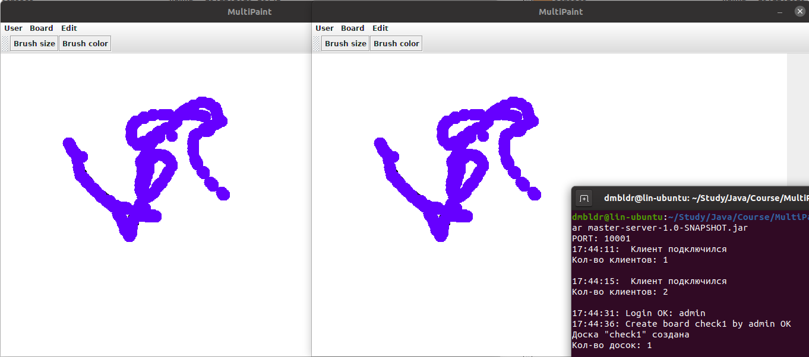

# MultiPaint

### Запуск из JAR-файла
В папке master-server/target/ запускаем командой java -jar master-server-1.0-SNAPSHOT.jar сервер приложения.
Затем в папке master-client/target/ запускаем командой java -jar master-client-1.0-SNAPSHOT.jar клиент приложения.

Клиент и сервер работают на порте 10001. Клиент автоматически подключается к 'localhost'.
